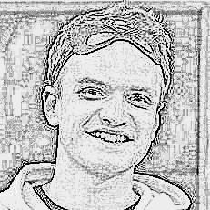
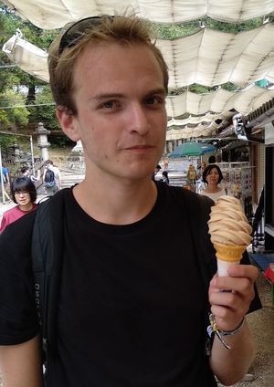
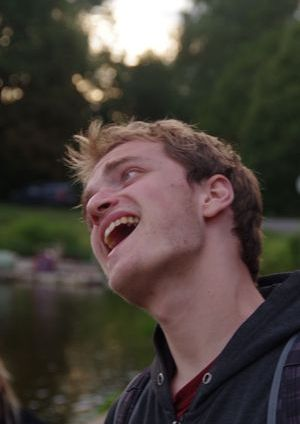

## Me
I am a **second-year PhD student** at the [Institute of Formal and Applied Linguistics](ufal.mff.cuni.cz/), Charles University, Prague. But here it might be more appropriate to say that I am just a guy who likes to test new ideas. Or that I am a graphomaniac with a withdrawal syndrome.

It is hard to describe a person in a single sentence. (Or a picture – see? 😁) 

---
## Website

On this website, I just want to ["talk"](blog) <i class="fa fa-comment-alt"></i>. I want to **explain** simply the concepts that I am familiar with and to **share** ideas which I find interesting. To collect the thoughts floating in my head.

Note: This is my **personal website**. I have also an [official academic website](https://ufal.mff.cuni.cz/zdenek-kasner) <i class="fa fa-university"></i> and my [LinkedIn profile](https://www.linkedin.com/in/zdenek-kasner/) <i class="fab fa-linkedin"></i>. If you are interested in my research, have a look also at the [Research](research) tab  – just keep in mind that I like to keep the descriptions here a bit more informal. You can also download my updated CV [soon].

<!-- But mainly there is this crazy idea that writing my thoughts on a public website will help to clear them up. -->

---
## Me²
Oh, you are still here? Then let me tell you more about [myself](https://www.youtube.com/watch?v=7yiOjcLEAGg)!

I learned many things at my alma mater [Czech Technical University](https://cvut.cz/) , before I moved on to [Charles University](https://cuni.cz/)  (both in Prague) to pursue a PhD in Computational Lingustics.

For every thing I learned at the university, I learned two at [Board of European Student of Technology](https://best.eu.org) . This student organization has been a part of my life for almost five years, and the life lessons I got from here are priceless. 

**Volunteering** <i class="fa fa-people-arrows"></i> is my way to meet like-minded people. I am always looking for new volunteering opportunities – organizing local [festivals](https://www.prahazijehudbou.cz) and [events](https://milionchvilek.cz), helping a [buddy](https://esncuprague.cz), going to [workcamps](tamjdem.cz), etc.

I love **traveling** as much as anybody else, but I mostly like to visit non-touristic places, meet local people and  [push my boundaries](x-challenge.cz/)  .

Recently I started to learn to play **guitar** <i class="fa fa-guitar"></i> on my own, and I can't wait for summer campfires...

**Languages** <i class="fa fa-language"></i> are another of my hobbies. I want to practice French or Dutch in the future again. And yes, I also learned Japanese, and no, I cannot speak it (well, nor can I speak the former two 😁).

I also read books and listen to podcasts, but because everyone can say that, it deserves to dig a bit deeper (and I will!).

---

Besides all of this, I also enjoy some other things which – for some reason – are even less mainstream:

- My only operating system is **Linux Mint 20.1** , and I didn't need to use Windows for... well, almost an eternity now.
- The more *punk* my travels are, the better. Hitchhiking, camping outside, [Couchsurfing](https://www.couchsurfing.com)...   (trains at Balkan or Ukraine also fit).
- I like **writing long texts** instead of posting pictures with hashtags <i class="fab fa-instagram"></i> or tweeting <i class="fab fa-twitter"></i>, so I mostly avoid socializing on social networks (although I like to use Twitter as a source of information).
- My most favourite music genres are **folk / progressive / symphonic metal** <i class="fa fa-music"></i> and I still have to find out why people don't listen to them much more.
- I use [shared bikes](https://www.nextbikeczech.com) <i class="fas fa-bicycle"></i> a lot, and I do not miss having a car at all. Also, I like the [14 T trams](https://en.wikipedia.org/wiki/%C5%A0koda_14_T) <i class="fas fa-tram"></i> the most (which is definitely not a mainstream opinion in Prague).
- To make the list complete: I have no opinion whatsoever on a **pizza with pineapple**. 🍕

---

And I usually avoid people taking pictures of me. Here's why:

  

    
  

  

    
  

