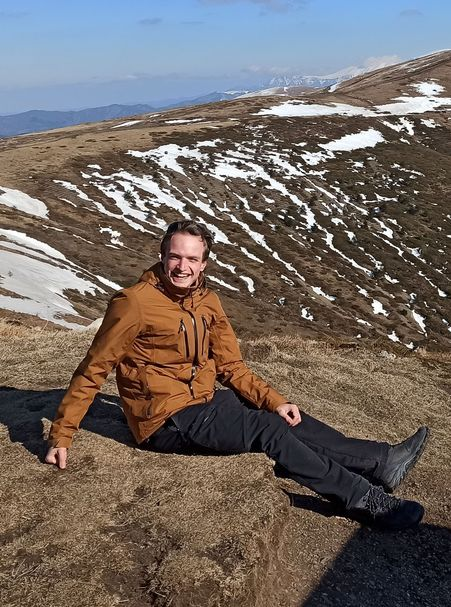

Some random facts about me:

I learned many things at my alma mater  [Czech Technical University](https://cvut.cz/) , before I moved on to  [Charles University](https://cuni.cz/) (both in Prague) to pursue a PhD in Computational Lingustics.

For every thing I learned at the university, I learned two at the  [Board of European Student of Technology](https://best.eu.org). This student organization has been a part of my life for almost five years and the life lessons I got from here are priceless. 

I love **traveling**: I have visited over 30 countries so far, but I prefer to spend longer time at one place. I have lived for a couple of months in Belgium, Japan, and Scotland. I also like to visit tucked away places, meet local people and push my boundaries with  [X-Challenge](https://x-challenge.cz/).

I am still looking for new <i class="fa fa-people-arrows"></i> **volunteering** opportunities – organizing local festivals and other events, helping as a buddy, going to workcamps, etc.

**Languages** are not just my work, but my hobby. I want to practice French or Dutch in the future again. And yes, I also learned Japanese, and no, I cannot speak it (well, nor can I speak the former languages).

Recently I started to learn to play <i class="fa fa-guitar"></i> **guitar** and I already expanded my [songbook](/projects) by quite a bit!

In general, I would describe myself as an **introvert** who likes socializing, meeting new people, and finding myself in new and uncomfortable situations 🙃

---

Besides all of this, I also enjoy some other things which – for some reason – are even less mainstream:

- My only operating system is  **Linux Mint** and I didn't need to use Windows for... well, almost an eternity now.
- I like <i class="fas fa-pen-nib"></i>  **writing long texts** instead of posting pictures with hashtags, so I mostly avoid being active on social networks. I would love to start blogging if only I find time for that!
- My favourite music genres are <i class="fa fa-music"></i> **folk / progressive / symphonic metal** which – although many people think otherwise – are beautifully complex and powerful kinds of music.

- The more punk my travels are, the better. Hitchhiking, camping outside,  [train festivals](https://vlakfest.cz/),  [couchsurfing](https://www.couchsurfing.com/people/zdenek-kasner)...
- I enjoy compact phones, especially with my [custom](/assets/keyboard.png)  [Multiling-o](https://play.google.com/store/apps/details?id=kl.ime.oh) keyboard, and I desperately wait for time when compact phones will come into fashion again.
- I am a big fan of <i class="fas fa-bicycle"></i> [shared bikes](https://www.nextbikeczech.com) and I do not miss having a car at all. Also, I like the <i class="fas fa-tram"></i> [14 T trams](https://en.wikipedia.org/wiki/%C5%A0koda_14_T) the most (which is definitely not a mainstream opinion in Prague).
- To make the list complete: I have no opinion whatsoever on a pizza with pineapple. 🍕
