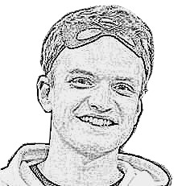

**I am currently looking for a post-doc position – [see my post](/research/2024/03/31/looking-for-postdoc.html)!**

---

Hi, I am Zdeněk /ˈzdɛɲɛk/, a PhD student of Computational Linguistics at Charles University, Prague. 

If you are interested in my work, here are a few pointers:
- my <i class="fa fa-area-chart"></i> [research](/research) and <i class="fa fa-graduation-cap"></i> [teaching](/teaching) activities,
- my <i class="fa fa-code-branch"></i> [personal projects](/projects),
- my <i class="fa fa-university"></i> [official academic website](https://ufal.mff.cuni.cz/zdenek-kasner),
- my  [Google Scholar](https://scholar.google.cz/citations?user=6NnuRB8AAAAJ) profile,
- my <i class="fab fa-linkedin"></i> [LinkedIn profile](https://www.linkedin.com/in/zdenek-kasner/),
- my <i class="fa fa-file-pdf"></i> [CV](/assets/cv/cv.pdf).

See also my <i class="fa fa-user"></i> [bio](/about) for my personal story.